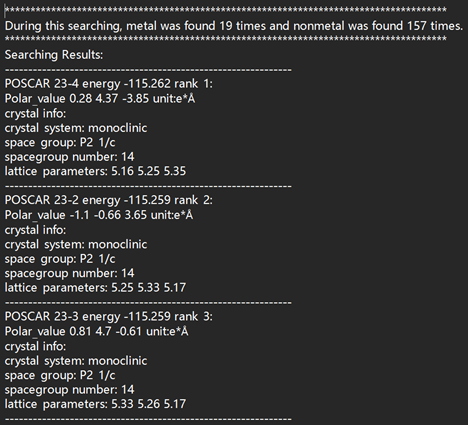
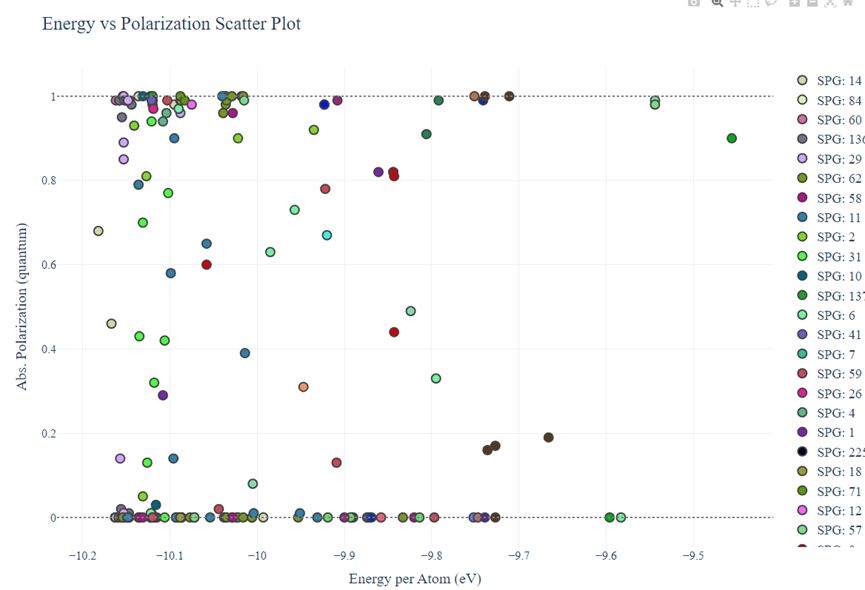

# DFSE 

## Environment and files information
Copy the whole files into workspace except *.md *.png and uncompiled IM2ODE folefold (use de.x - the compiled file).

### Environment
```bash
conda create -n DFSE python=3.8
conda activate DFSE
pip install -r requirements.txt
```
We highly recommand to use DFSE in a  high-performance cluster, with vaspkit tools, VASP DFT software and gcc >= 12.1.0. If running 2D materials better use a fix c version VASP or add OPTCELL file if VASP version = 6.x
### Files information
- de.x -- compiled from IM<sup>2</sup>ODE package
- python scripts

| Scripts | Function | 
| :------ | :------ |
| ferroelectric_search.py | 1. generate centrosymmetric phases|
|                         | 2. add perturbation to generate ferroelectric candidates | 
|                         | 3. process data |
|read_poscar.py| Read POSCAR file|
| screening_POSCAR.py | Screening of centrosymmetric phases to ensure varity of structures|
|get_POSCAR.py|Verify the symmetric of the structure --bounary problem of two-dimensional layer groups|
|export_figures|Visualization the searching results|
---

- test.sh -- bash script for main program 
- INCAR_1 INCAR_2 INCAR_3 INCAR_4 -- several INCAR_* files for vasp running

| INCAR_* | Function | 
| :------ | :------ |
| INCAR_1 | relax centrosymmetric phases|
| INCAR_2 | static calucation for centrosymmetric phases and ferroelectrics candidates | 
| INCAR_3  | Berry phase for polarization value |
| INCAR_4  | relax ferroelectrics candidates|
---


- POTCAR for DFT 

## change the parameters in test.sh for you own system
### running environment parameters( Slurm & linux )
```bash
#!/bin/sh
#SBATCH -J HfO2-2d-12-atoms
#SBATCH -N 1
#SBATCH -n 48
#SBATCH -t 168:0:0
#SBATCH -p wholenodeQ
#SBATCH --output=%j.out
#SBATCH --error=%j.err

export LD_LIBRARY_PATH=/public/software/compiler/intel-compiler/2021.3.0/mkl/lib/intel64/:$LD_LIBRARY_PATH
#module load mpi/intelmpi/2021.3.0
#module load apps/vasp/intelmpi/5.4.4
cd $SLURM_SUBMIT_DIR
#mpirun -np 48 /public/software/apps/vasp/intelmpi/5.4.4/bin/vasp_std >out.vasp
source /public/home/win0812/intel/oneapi/setvars.sh --force
export PATH=/public/home/win0812/intel/oneapi/mkl:$PATH

export PATH=/public/home/win0812/gcc/gcc-12.1.0/objdir/bin:/public/home/win0812/gcc/gcc-12.1.0/objdir/lib64:$PATH
export LD_LIBRARY_PATH=/public/home/win0812/gcc/gcc-12.1.0/objdir/lib/:/public/home/win0812/gcc/gcc-12.1.0/objdir/lib64/:$LD_LIBRARY_PATH

ulimit -s unlimited
chmod 777 de.x 
conda activate  ferroelectric_search
# Output files
results_file="./results.dat"
log_file="./run.log"
num_parallel=48    # Number of parallel processes
IM2ODE_runtime=300
Perturbation_times=2
MAX_LOOPS=5 #for sturcture relaxzation
MAX_TIME1=7200 #for one time vasp max running time in second when relax the reference phase
MAX_TIME2=12800 #for  one time vasp max running time in second when relax the ferroelectric candidates
#please change VASP_COMMAND for your environment
VASP_COMMAND="mpirun -np 48 /public/home/win0812/software/vasp.5.4.4/bin/vasp_std"
# Function to generate random numbers within a specified range
```
### IM<sup>2</sup>ODE running parameters
```bash
# Ranges for the variables
DIS_min=1.5  #Distance matrix
DIS_max=4.0
Volumn_min=240.0  # Volumn for 3D searching
Volumn_max=300.0
AREA_min=24.0     #Area for 2D searching
AREA_max=27.0
LAYER_HEIGHT_min=5.0  #Layer height for 2D searching
LAYER_HEIGHT_max=7.0
```
```bash
### basic information for searching
SystemName=Hf4O8
NumberOfSpecies=2
NumberOfElements=4 8
NameOfElements=Hf  O 
DistanceOfAtom=
DIS1=$DIS1_1 $DIS1_2 #$DIS1_3
DIS2=$DIS2_1 $DIS2_2 #$DIS2_3
#DIS3=$DIS3_1 $DIS3_2 $DIS3_3
Population=10
MaxStep=1
#Volumn=$Volumn
#2D system setting
Q2D=T
vacuum_layer=15
Area=$AREA
Layer_height=$LAYER_HEIGHT

#polarization switch and choose crystal system for initial strcuture generation

#polarization_3d = .TRUE.
#crystal_system_3d = 2 3 4 5 6 7 
#crystal_system_count_3d = 6

polarization_2d = .TRUE.
crystal_system_2d = 1 2 3 4 5 6  
crystal_system_count_2d = 6

#FQFE switch and perturbation coefficient
FQFE=.FALSE.
COEFFICIENT=0.06
```
submit the test.sh and waiting for program running

## running results

The searching results is saved in ferro_search_results filefold and the detailed information is recorded in results.info file. Also, the results would be visualized and can be check in scatter_plot.html



